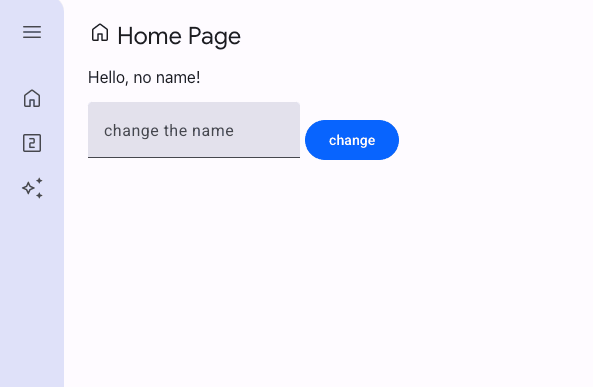

# Studio Scaffold for Mesop


Mesop scaffold for Studio style apps.

This is an example of a multi-page Mesop UX application, where:

* individual pages have their own state management while also having access to an application state
* Mesop custom components are used to facility app scaffolding, with side navigation and header




## Open in Project IDX

Project IDX is an entirely web-based, integrated development environment. IDX can help you build and deploy applications in various tech stacks. To open this project in IDX, select the button below.

<a href="https://idx.google.com/new?template=https%3A%2F%2Fgithub.com%2Fghchinoy%2Fstudio-scaffold">
  <picture>
    <source
      media="(prefers-color-scheme: dark)"
      srcset="https://cdn.idx.dev/btn/open_dark_32@2x.png">
    <source
      media="(prefers-color-scheme: light)"
      srcset="https://cdn.idx.dev/btn/open_light_32@2x.png">
    
  </picture>
</a>

## Local development

### Prerequisites

A python virtual environment, with required packages installed.

Using [uv](https://github.com/astral-sh/uv):

```
# create a virtual environment
uv venv venv
# activate the virtual environment
. venv/bin/activate
# install the requirements
uv pip install -r requirements.txt
```


## Mesop scaffold app

### Prerequisites


### Start the app


Start the app to explore

```
mesop main.py
```

## Enable the Gemini Page

This scaffold comes with two pages enabled, and a third page that uses Gemini, is commented out. To use it, you'll have to set a Google Cloud Project

### Create an .env file

This app uses Gemini, so you'll also need to create a `.env` file with the following:

```
PROJECT_ID=YOUR_PROJECT_ID
LOCATION=us-central1
MODEL_ID=gemini-2.0-flash-exp
```

Your GCP Project ID can be obtained via `gcloud config get project`

### Uncomment references to Page & Side Nav

In `main.py`, uncomment:

* line 21, `#from pages.gemini2 import gemini_page_content`
* lines 51-60, the mesop page definition for the Gemini page

In `components/side_nav.py`, uncomment the entry in the `page_json` list 

* line 27, `{"display": "Gemini", "icon": "auto_awesome", "route": "/gemini"},``


# Disclaimer

This is not an official Google project